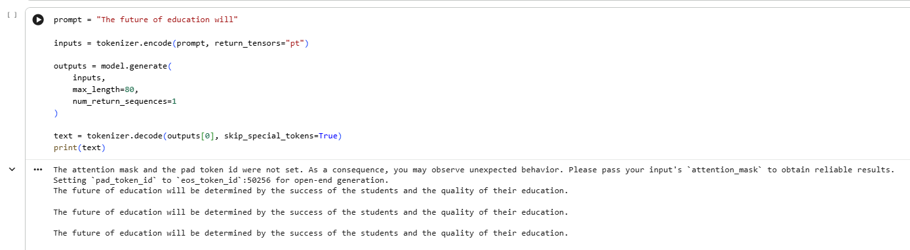

# GPT-2 Text Generation

This project generates text using the GPT-2 model.

---

## What I did
- Loaded a pre-trained GPT-2 model
- Gave input prompt
- Generated output text

---

## Tools Used
- Python
- Transformers
- Google Colab

---

## Output

---

## Files
- gpt2_text_generation.ipynb → code
- output.png → result screenshot

---

## Note
This project was done as part of a Generative AI internship.
